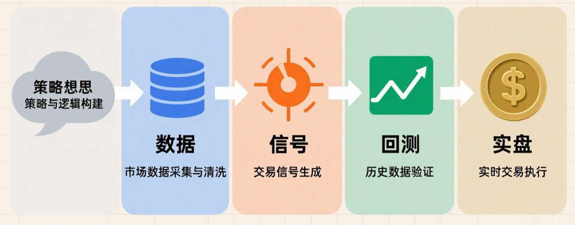
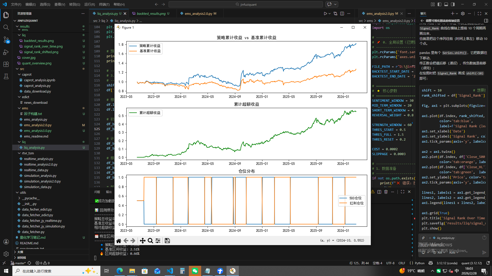

# 量化学习手册
<div align="center">

</div>

> 面向中文读者的量化入门手册。本手册主要整理了量化领域的基础框架、量化所需的相关知识，以及量化研究领域的工作流，以及个人的一部分量化研究成果。第一版已完结，第二版持续更新中...

## 📚 目录
- [前言](#前言)
- [安装](#安装)
- [符号](#符号)
- [1 量化策略分类](#1-量化策略分类)
  - [1.1 量价策略](#11-量价策略)
  - [1.2 多因子策略](#12-多因子策略)
  - [1.3 统计套利策略](#13-统计套利策略)
  - [1.4 事件驱动策略](#14-事件驱动策略)
  - [1.5 高频交易策略](#15-高频交易策略)
  - [1.6 另类数据策略](#16-另类数据策略)
  - [1.7 机器学习策略](#17-机器学习策略)

- [2 量化数据基础](#2-量化数据基础)
  - [2.1 数据类型](#21-数据类型)
  - [2.2 数据源](#22-数据源)
  - [2.3 数据质量和清洗](#23-数据质量和清洗)
  - [2.4 数据存储和管理](#24-数据存储和管理)

- [3 因子研发工作流](#3-因子研发工作流)
  - [3.1 什么是因子](#31-什么是因子)
  - [3.2 因子逻辑梳理](#32-因子逻辑梳理)
  - [3.3 数据准备和预处理](#33-数据准备和预处理)
  - [3.4 因子构建](#34-因子构建)
  - [3.5 因子有效性检验](#35-因子有效性检验)
  - [3.6 因子调参](#36-因子调参)
  - [3.7 因子库管理](#37-因子库管理)
  - [3.8 其他](#38-其他)

- [4 策略制定工作流](#4-策略制定工作流)
  - [4.1 信号序列生成](#41-信号序列生成)
  - [4.2 多因子信号组合优化](#42-多因子信号组合优化)
  - [4.3 仓位管理机制](#43-仓位管理机制)
  - [4.4 引入交易成本](#44-引入交易成本)
  - [4.5 风险控制](#45-风险控制)
  - [4.6 其他](#46-其他)

- [5 回测验证工作流](#5-回测验证工作流)
  - [5.1 回测验证工作流](#5-回测验证工作流)

- [6 实盘部署工作流](#6-实盘部署工作流)
  - [6.1 一个常见的误解](#61-一个常见的误解)
  - [6.2 API接口](#62-API接口)

- [7 个人量化研究成果](#7-个人量化研究成果)
  - [7.1 CAPROT](#71-CAPROT)
  - [7.2 EMS](#72-EMS)
  - [7.3 RTVR_TSM](#73-RTVR_TSM)
  - [7.4 EDICT](#74-EDICT)

- [8 量化产品种类](#8-量化产品种类)

- [9  策略生命周期管理](#9-策略生命周期管理)

- [10 风险管理进阶](#10-风险管理进阶)
  - [10.1 黑天鹅应对](#101-黑天鹅应对)

- [11 量化中的机器学习](#11-量化中的机器学习)

- [12 从业者指南](#12-从业者指南)
  - [12.1 量化职业路径](#121-量化职业路径)
  - [12.2 量化面试准备](#122-量化面试准备)
  - [12.3 量化社区资源](#123-量化社区资源)
  - [12.4 量化书籍推荐](#124-量化书籍推荐)
  - [12.5 量化工具推荐](#125-量化工具推荐)
  - [12.6 量化合规要点](#126-量化合规要点)

- [13 我的多平台量化软件](#13-我的多平台量化软件)
  - [13.1 软件功能](#131-软件功能)

- [14 我的量化之路](#14-我的量化之路)
  - [14.1 踩过的坑](#141-踩过的坑)

## 前言
> 这本书代表了我的尝试——让量化交易亦可平易近人，教会人们概念、逻辑和代码。

### 量化的简笔画
<div align="center">

</div>

## 安装
> 我们需要配置一个环境来运行 Python、Jupyter Notebook、相关库以及运行本书所需的代码，以快速入门并获得动手学习经验。

### 安装 Conda
> Conda 是一个开源的包管理系统和环境管理系统，可以帮助我们轻松安装和管理 Python 以及相关的库和工具。

最简单的方法就是安装依赖Python 3.x的Miniconda或者Anaconda。 如果已安装conda，则可以跳过以下步骤。访问Miniconda或者Anaconda网站，根据Python3.x版本确定适合的版本。

如果是macOS系统，假设Python版本是3.9，将下载名称包含字符串“MacOSX”的bash脚本，并执行以下操作：
```bash
bash Miniconda3-py39_4.9.2-MacOSX-x86_64.sh
```
如果是Linux系统，假设Python版本是3.9，将下载名称包含字符串“Linux”的bash脚本，并执行以下操作：
```bash
bash Miniconda3-py39_4.9.2-Linux-x86_64.sh
```
接下来，初始化终端Shell，以便我们可以直接运行conda。
```bash
conda init
```

### 创建虚拟环境
> 虚拟环境可以帮助我们隔离不同项目的依赖，避免版本冲突。

我们将创建一个名为quant_env的虚拟环境，并安装Python 3.9。
```bash
conda create -n quant_env python=3.9
```
创建完成后，激活虚拟环境，即可在该环境中安装和运行量化相关的库和工具。
```bash
conda activate quant_env
```

### Package安装
> 在激活的虚拟环境中，我们可以安装量化交易所需的库和工具。

设置全局使用清华大学的镜像源来加速安装过程：
```bash
conda config --add channels https://mirrors.tuna.tsinghua.edu.cn/anaconda/pkgs/free/
conda config --add channels https://mirrors.tuna.tsinghua.edu.cn/anaconda/pkgs/main/
conda config --set show_channel_urls yes
```
或者
```bash
python -m pip install --upgrade pip
pip config set global.index-url https://mirrors.tuna.tsinghua.edu.cn/pypi/web/simple
```
- 常用的量化交易库：pandas、numpy、matplotlib、scikit-learn，按需安装即可。
- 机器学习和深度学习库：TensorFlow、PyTorch，按需安装即可。

### IDE推荐
> IDE（集成开发环境）可以提供代码编辑、调试、版本控制等功能，提升开发效率。

- Microsoft Visual Studio Code：轻量级、功能强大，社区支持丰富，支持多种编程语言和扩展。
- PyCharm：专为Python开发设计，提供丰富的功能和工具，尤其适合特征工程，适合专业的Python开发者。
- Cursor：一款新兴的AI驱动的IDE，提供智能代码补全、错误检测和自动化功能，适合追求高效开发体验的用户。
## 符号
本书暂定不进行符号的集中定义，在后续章节中会根据需要进行定义和说明。
## 1 量化策略分类
> 本章节仅提供一个较为粗略的分类框架，实际的量化策略种类繁多，且经常交叉融合。目的是为了让读者对量化策略有一个具象化的第一印象。
### 1.1 量价策略
> 市场交易数据，反映资产价格和市场行为，是最直观、最基础的量化策略类型。
- 开盘价、收盘价、最高价、最低价等价格数据。
- 成交量、成交额等交易量数据。
- 换手率、量比、流动性等衍生指标。
- 正在研究中的量价策略：CAPROT EMS RTVR_TSM EDICT LIQ
### 1.2 多因子策略
> 目前机构量化中最主流的策略之一。它不单纯依赖价格走势，而是通过挖掘多个“因子”来预测股票未来的超额收益。
- 基本面因子：如市盈率 (PE)、市净率 (PB)、ROE、营收增长率、现金流等。
- 成长因子：净利润增速、分析师预期上调幅度等。
- 价值因子：低估值选股。
- 质量因子：高盈利能力、低负债率。
- 逻辑（举例）：通过线性或非线性模型（如机器学习）将几十甚至上百乃至上千个因子合成一个综合得分，买入得分高的股票，卖空或低配得分低的股票。
### 1.3 统计套利策略
> 基于统计学原理，寻找资产价格之间的暂时性偏离，并赌其回归正常关系。
- 配对交易 (Pairs Trading)：寻找两只历史走势高度相关的股票（如可口可乐和百事可乐），当两者价差异常扩大时，做空强势股、做多弱势股，等待价差收敛。
- 均值回归：认为价格波动围绕某个均值进行，当价格大幅偏离均线时进行反向操作。
- 协整策略：比相关性更严格的数学关系，用于构建多空组合。
### 1.4 事件驱动策略
> 不依赖连续的价格序列，而是针对特定的公司事件或宏观事件进行交易。
- 财报季策略：在财报发布前后，根据超预期或低于预期的程度，结合历史反应模式进行交易（如“盈余公告后漂移” PEAD）。
- 并购套利 (Merger Arbitrage)：在宣布并购后，买入被收购方，做空收购方（或仅买入被收购方），赚取宣布价与最终成交价之间的价差，赌并购成功。
- 指数 rebalancing：在指数成分股调整生效日前后，利用被动基金的调仓行为获利。
- 回购/分红事件：针对公司宣布大额回购或高分红计划时的市场反应。
### 1.5 高频交易策略
> 虽然也属于量价范畴，但其技术门槛和逻辑与传统量价策略完全不同，主要依靠极快的速度和微观结构。
- 做市策略 (Market Making)：同时挂买单和卖单，赚取买卖价差 (Bid-Ask Spread)，并提供流动性获取交易所返佣。
- 延迟套利：利用不同交易所或不同数据源之间的微小时间差进行套利。
- 订单流分析：分析 Level-2 或 Level-3 的逐笔委托数据，识别大单意图（如冰山订单）并跟随或反向操作。
### 1.6 另类数据策略
> 随着大数据的发展，这类策略越来越重要。它们使用非传统的金融数据。
- 舆情分析 (NLP)：爬取新闻、社交媒体（如Twitter、微博、股吧）、研报，利用自然语言处理技术分析市场情绪（正面/负面）。
- 卫星图像：通过分析停车场车辆数量预测零售商营收，或通过油罐阴影长度预测原油库存。
- 供应链数据：追踪货运、海关数据等。
- 消费数据：信用卡刷卡记录、电商销售数据等。
### 1.7 机器学习策略
> 这不是一个独立的策略类别，而是一种方法论，可以应用于上述所有策略中，但近年来已独立成派。
- 多因子优化：使用机器学习（如随机森林、XGBoost）来选择和加权因子，而不是简单的线性加权。
- 非线性映射：使用深度学习（如 LSTM, Transformer, GNN）直接从原始数据（甚至包括K线图图像、文本）中学习特征，不再依赖人工定义的因子。
- 强化学习 (Reinforcement Learning)：让AI代理在模拟环境中通过试错学习最优的交易执行路径或仓位管理策略。

## 3 因子研发工作流

### 3.1 什么是因子
> 因子是量化投资中用于预测资产未来表现的变量。通俗来说，就是制定交易策略所需要的“信号”。它们可以是基于价格、基本面、技术指标、情绪等多种类型的数据。因子是量化交易的起点，只有构建出了信号，策略才有了依据。
### 3.1.1 生产环境中常见因子
- 价格动量因子：如过去12个月的收益率。
- 价值因子：如市盈率 (PE)、市净率 (PB)
- 成长因子：如净利润增速、营收增速。
- 质量因子：如ROE、毛利率。
- 波动率因子：如过去30天的收益率标准差。

值得注意的是，因子并不一定是单一的指标，它们可以是多个指标的组合（如多因子模型中的综合得分），也可以是通过机器学习从原始数据中提取的特征。无论是哪种形式，因子都需要经过严格的检验和验证，才能在实盘中使用。

### 3.2 因子逻辑梳理
> 在构建因子之前，首先需要明确因子的投资逻辑和理论基础。

构建逻辑包括但不限于以下几个方面：
- 基于经济学原理：如风险补偿理论（流动性、市场冲击指标）、市场效率假说等
- 基于行为金融学：如投资者过度自信、羊群效应等
- 不可解释的枚举因子：如基于机器学习从数据中提取的特征，虽然可能缺乏明确的经济学解释，但如果回测表现优异且样本外稳健，也可以考虑使用。

### 在实际生产环境中
- 个人习惯建立因子逻辑文档，记录理论依据、参考文献及假设条件。针对逻辑薄弱或纯数据驱动的因子，即使回测表现优异，也需谨慎对待其样本外稳健性。
- 在当下的工业化生产因子环境下，因子挖掘与策略开发通常是解耦的，具体将在后续章节中介绍策略制定工作流时进行详细说明。


### 3.3 数据准备和预处理（特征工程）
> 因子构建需要大量的历史数据，数据的质量和预处理直接影响因子的有效性。

### 3.3.1 数据下载
> 量化研究第一步。

数据来源简单分类主要有三种：
- 第三方数据提供商： Tushare、聚源、Wind、Bloomberg等，提供全面的历史数据和财务数据，但通常需要付费。
- 自行爬取：通过编写爬虫从公开网站（如Yahoo Finance、东方财富网）获取数据，适合特定需求但需要处理反爬机制，Python提供相关的爬虫库（如requests、BeautifulSoup、Scrapy）来实现数据爬取。
- 大型量化机构通常会有自己的数据库，并且随时进行数据更新和维护，确保数据的完整性和准确性。

### 3.3.2 数据清洗
> 数据清洗是指对原始数据进行处理，去除错误、缺失值和异常值，以确保数据的质量和可靠性。
- 处理缺失值：可以选择删除包含缺失值的行或列，或者使用插值、均值填充或者直接填充NA再后期识别等方法进行填补。
- 处理异常值：可以使用统计方法（如Z-score、IQR）识别异常值，并根据具体情况进行处理，如删除、替换或保留。
- 数据类型转换：确保数据的类型正确，如将日期转换为datetime格式，将数值数据转换为float或int等。
- 数据对齐：确保不同数据源的数据在时间和标的上对齐，
- 频率对齐：将不同频率的数据（如日频、周频、月频）进行对齐，通常需要进行重采样或插值。

### 3.3.3 特征工程
> 原始数据又是不会直接用于因子构建，而是通过特征工程将原始数据转换为更有意义的特征，以提高因子的预测能力。工业场景几乎是必要环节。
- 特征选择：从原始数据中选择与目标变量相关性较高的特征，可以使用统计方法（如相关系数、方差分析）或机器学习方法（如随机森林、Lasso回归）进行特征选择。
- 特征提取：通过数学变换或组合原始特征来创建新的特征，如技术指标（移动平均线、相对强弱指数等）、财务比率（如PE、PB）等。
- 特征缩放：将特征值缩放到相同的范围，以避免某些特征对模型训练产生过大的影响，常用的方法有标准化（Z-score）和归一化（Min-Max Scaling）。
- 特征编码：将分类变量转换为数值形式，如独热编码（One-Hot Encoding）或标签编码（Label Encoding）。

### 3.4 因子构建
> 有了清洗后的数据和经过特征工程处理的特征，就可以开始构建因子了。因子构建是指根据预先定义的逻辑和方法，将原始数据转换为可用于交易策略的信号。

### 举个例子
> 实盘使用过的一个流动性相关的因子，基于流动性的市场冲击指标来指导交易。具体来说，构建了一个基于成交量和价格波动的指标，来衡量市场的流动性状况。当该指标显示市场流动性较差时，可能意味着价格容易受到大单交易的影响，从而提供了一个潜在的交易信号。

仅展示了因子构建部分的代码，完整案例请见个人量化研究成果章节中的LIQ因子。
```python
# 初始信号（窗口期内的平均收益率/窗口期内的平均交易量）
"""
指标越高时，说明较小的成交量就能够导致较大幅度的价格变化，这意味着这笔交易对于个股价
格的冲击较大，从某种层面意味着个股的流动性越差。
"""
df['Signal_500'] = df['Ret_Index_500'].rolling(window=WINDOW_SIZE).mean() / df['TV_500'].rolling(window=WINDOW_SIZE).mean()
df['Signal_HL'] = df['Ret_Index_HL'].rolling(window=WINDOW_SIZE).mean() / df['TV_HL'].rolling(window=WINDOW_SIZE).mean()

# 修正：使用滚动窗口标准化（避免使用全序列统计量导致的未来函数）
df['Signal_500'] = (df['Signal_500'] - df['Signal_500'].rolling(WINDOW_SIZE*2).mean()) / (df['Signal_500'].rolling(WINDOW_SIZE*2).std() + 1e-10)
df['Signal_HL'] = (df['Signal_HL'] - df['Signal_HL'].rolling(WINDOW_SIZE*2).mean()) / (df['Signal_HL'].rolling(WINDOW_SIZE*2).std() + 1e-10)

# 两者作差，形成相对性信号（大于0表示500指数表现更好，小于0表示沪深300表现更好）
df['Signal'] = df['Signal_500'] - df['Signal_HL']

# 计算该信号在历史上的分位数（相对于过去HISTORY_WINDOW个交易日）
df['Signal_Rank'] = df['Signal'].rolling(window=HISTORY_WINDOW).apply(lambda x: percentileofscore(x, x.iloc[-1]) / 100)
```

### 3.5 因子有效性检验
> 相当重要的一环，只有经过严格检验的因子才有可能在实盘中使用。

常见的

### 3.6 因子调参
> 因子调参是指在因子构建过程中，根据回测结果和实际表现，对因子的参数进行调整和优化的过程。通过调整参数，可以提升因子的预测能力和实盘表现。
- 网格搜索 (Grid Search)：在预定义的参数范围内，穷举所有可能的参数组合，评估每个组合的表现，选择最佳参数。
- 随机搜索 (Random Search)：在预定义的参数范围内，随机采样一定数量的参数组合进行评估，效率较高，适合参数空间较大的情况。
- 贝叶斯优化 (Bayesian Optimization)：通过构建代理模型（如高斯过程）来预测不同参数组合的表现，并根据预测结果选择下一个参数组合进行评估，效率更高，适合复杂的参数空间。

### 3.7 因子库管理
> 随着因子研发的不断进行，积累了大量的因子，需要一个系统化的管理方式来存储、检索和维护这些因子。因子库管理可以帮助研究者快速找到已有的因子，避免重复研发，同时也便于对因子进行版本控制和性能跟踪。

### 3.7.1 因子库长啥样

### 3.7.2 因子库维护


## 4 策略制定工作流

### 4.3 仓位管理机制
> 仓位管理是指在交易过程中如何分配资金和控制风险的机制。它包括多种调仓机制：阈值调仓、线性调仓、非线性调仓（如sigmoid函数）、分层调仓等。合理的仓位管理可以在提升收益的同时控制风险，避免过度交易或过度集中。

### 4.3.1 阈值调仓
阈值调仓是一种“开关式”调仓，容易导致交易频繁、换仓剧烈、滑点成本高，且无法充分利用信号的连续信息。但是在因子的研发初期，可以通过阈值调仓快速验证因子的有效性，毕竟它的实现简单、逻辑清晰，适合初学者入门。若因子表现优异，可以进一步优化为线性或非线性调仓机制，以更平滑地利用信号强度，提升策略的稳定性和收益表现。

### 4.3.2 线性调仓
线性调仓是一种根据因子信号强度线性调整仓位的机制。它可以更平滑地利用信号信息，避免了阈值调仓的频繁交易问题，同时也能更充分地利用因子信号的连续性，从而提升策略的稳定性和收益表现。

### 4.3.3 非线性调仓
非线性调仓是一种根据因子信号强度非线性调整仓位的机制。常见的非线性函数包括sigmoid函数、tanh函数等，它们可以在信号较弱时给予较小的仓位，在信号较强时给予较大的仓位，从而更有效地利用因子信号的强度信息，提升策略的风险调整后收益。还可以避免在中性区间过度交易，同时在极端信号时给予足够的仓位以捕捉潜在的超额收益。

## 5 回测验证工作流

## 6 实盘部署工作流
> 构建了有效的因子并且也有了完善的策略，终于可以大显身手了！

### 6.1 一个常见的误解
很多人一听到量化，就认为是完全自动化的交易系统，实际上在目前的工业环境中，完全自动化的量化系统并不普遍，尤其是在股票市场。大多数量化策略仍然需要人工干预和监督，特别是在策略的执行和风险管理方面。并且大部分量化策略的交易频率并不高，可能是日内交易，也可能是更长周期的交易（如周频、月频），自动化交易显得画蛇添足。

当然也有自动化交易必须存在的场景，比如高频交易，这类交易策略往往需要实时监听市场数据并且根据预设的算法快速做出交易决策，这可能是分钟级、交割单级甚至是毫秒级的交易频率，在这种情况下，自动化交易系统是必不可少的。

### 6.2 API接口
> 不用但是不可以不知道，介绍一些常见的API对接方式和工具，我们还是可以感受一下躺着赚钱的感觉。
## 7 个人量化研究成果

## 8 量化产品种类

## 9  策略生命周期管理

## 10 风险管理进阶

## 11 量化中的机器学习

## 12 从业者指南

## 13 我的多平台量化软件

## 14 我的量化之路
### 14.1 踩过的坑
> 在量化研究的过程中，我也踩过的不少坑，实践出真知，都是一步一步踩过来的血泪教训。个人认为对于无论初学者还是有经验的研究者，都是非常有价值的借鉴和警示。
### 14.1.1 前视偏差
在构建因子或策略时，使用了未来数据（如未来的价格、财报数据等），导致回测结果过于乐观，无法在实盘中复制。当时是在做一个流动性相关的因子，基于流动性的市场冲击指标来指导交易。使用了未来20天的成交量数据来构建因子，回测表现非常好，刚开始实盘甚至有稳定超额，在发现是前视偏差之后甚至还将错就错，认为这个信号具有惯性，事实证明没有人可以穿越到未来，这个前视偏差我记录了很长时间，最终也已惨败告终。就是为了说服自己必须严格区分训练数据和测试数据，确保因子构建过程中不使用任何未来信息。
<div align="center">

</div>